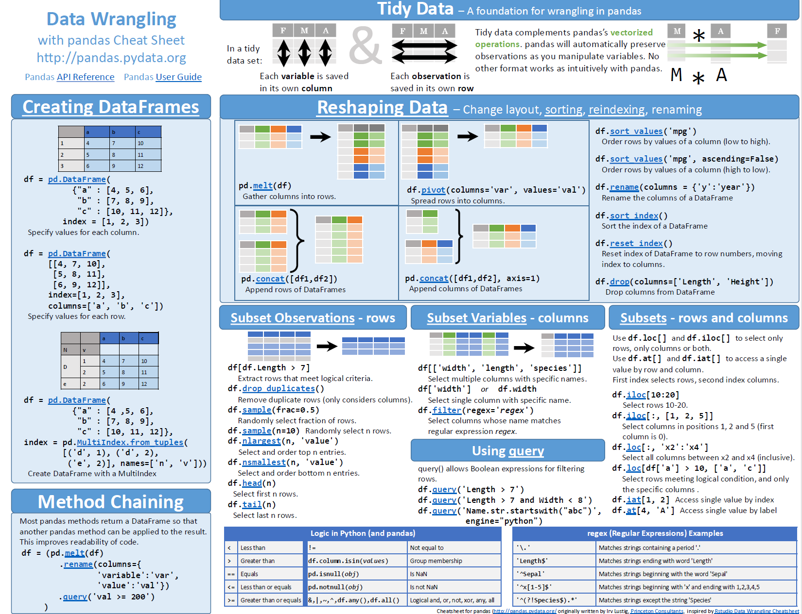

# pandas-practice

This repository contains my hands-on practice with [pandas](https://pandas.pydata.org/) for learning and reference.  
I upload basic examples, code snippets, and notes as I explore and learn pandas for data analysis in Python.

## Contents

- **01-practice.ipynb**: Jupyter notebook with pandas basics, DataFrame creation, reshaping, filtering, sorting, and more.
- **Dummy_Dataset.csv**: Sample dataset used for practice.

## Purpose

This repo is for my personal learning and practice.  
Feel free to explore the notebooks if you are also learning pandas!

---
